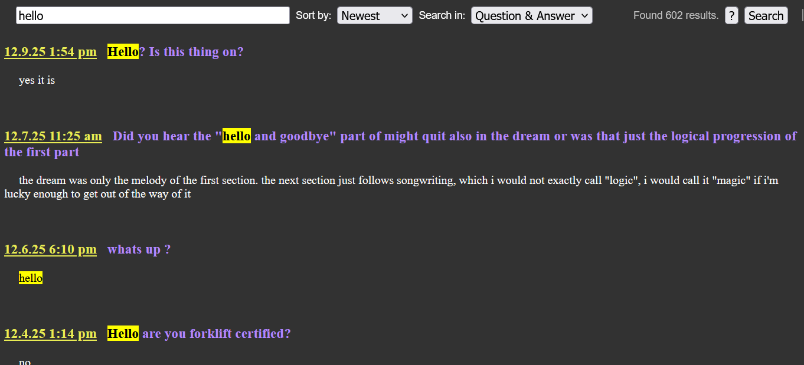

# Bill Wurtz Search
### A fan-made search engine for Bill Wurtz's [questions](https://billwurtz.com/questions/questions.html) page.
## Open it [here](https://billwurtz-search.github.io)!!

## Why?
Why not? Searching is cool. Searching with Regex is even cooler.

## How does it work?
I scraped the questions page and made it one big json file that IS actually parsable, instead of the nightmare that is Bill's html. Then I had to split them into 14 individual files because it was too big for Github. Rest is vanilla js.

## Will you update the log files?
Occasionally. Just don't yell at me now/in the far future if I don't touch this in a month.

## Can I use the log files myself?
YES!! You can do anything with it. Actually, I would love to see someone analyzing it.

## Is [this](https://www.billwurtz-search.com) you?
No, I am not affiliated with that site, though this project is heavily inspired by that. The reason I've made my own is because that website doesn't work anymore.

## About pull requests
i don't really know how github works. you can make stuff and dm it to me.

## License
1\) This project is "unlicensed" as in public domain. 2) I don't own the logs, their content is from Bill Wurtz. 3) THE SOFTWARE IS PROVIDED "AS IS", WITHOUT WARRANTY OF ANY KIND.

## Contact
I don't know. Just DM my [Reddit account](https://reddit.com/user/Kuzeyy27). I don't go on Reddit a lot, but this felt "safer" than putting my email on the internet.
Also, if you have actual serious issues with this, please still contact me in the same way. I will take it down.
