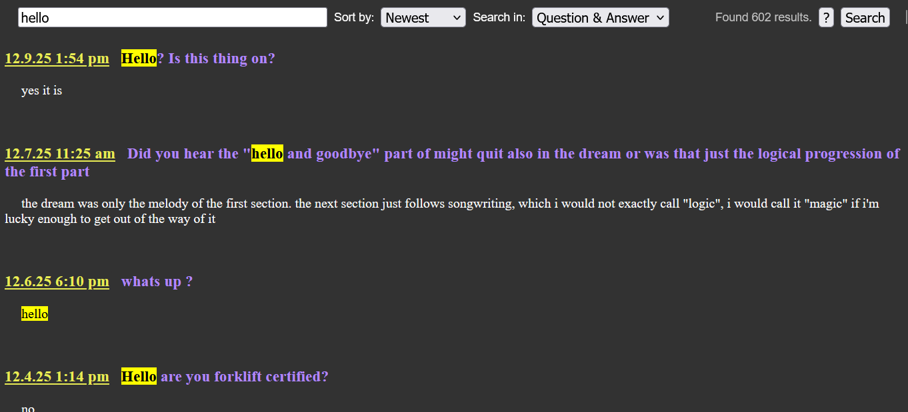

# Bill Wurtz Search
### A fan-made search engine for Bill Wurtz's [questions](https://billwurtz.com/questions/questions.html) page.
## Open it [here](https://billwurtz-search.github.io)!!

## Why?
Why not? Searching is cool. Searching with Regex is even cooler.

## Will you update the database?
Occasionally.

## How does it work?
I don't know.

## About pull requests
Sure, you can send me suggestions or even fixes if you fix something.

## How does it work?
I figured it out. See [main.js](main.js) and [search.js](search.js).

## License
1\) This project is "unlicensed" as in public domain. 2) I don't own the logs, their content is from Bill Wurtz. 3) THE SOFTWARE IS PROVIDED "AS IS", WITHOUT WARRANTY OF ANY KIND.

## Contact
Message my [Reddit account](https://reddit.com/user/Kuzeyy27). I don't go on Reddit a lot, but this felt "safer" than putting my email on the internet.
Also, if you have actual serious issues with this, please still contact me in the same way. I will take it down.
