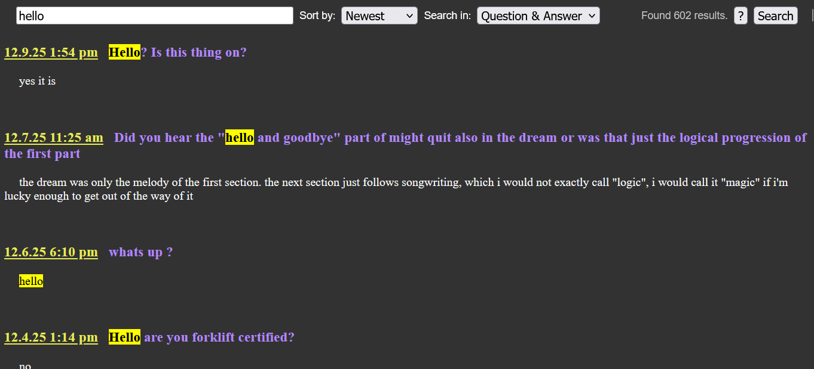

# Bill Wurtz Search
### A fan-made search engine for Bill Wurtz's [questions](https://billwurtz.com/questions/questions.html) page.
## Open it [here](https://billwurtz-search.github.io)!!

## Why?
Why not? Searching is cool. Searching with Regex is even cooler.

## Will you keep the questions up to date?
Occasionally.

## About pull requests
Sure, you can send me suggestions or even fixes if you fix something.

## License
1) I don't own the logs; their content is property of Bill Wurtz.
2) The rest of this project (the "software") is licensed under the [MIT license](LICENSE).

## Contact
Message my [Reddit account](https://reddit.com/user/Kuzeyy27). I don't go on Reddit a lot, but this felt "safer" than putting my email on the internet.
Also, if you have actual serious issues with this, please still contact me in the same way. I will take it down.
